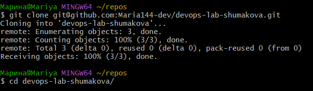
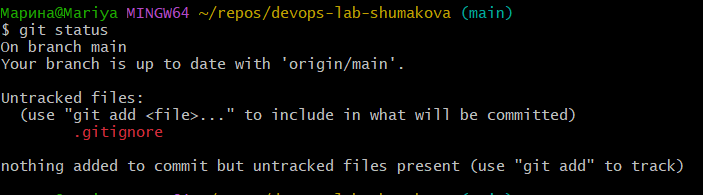
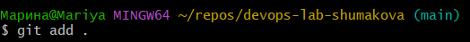
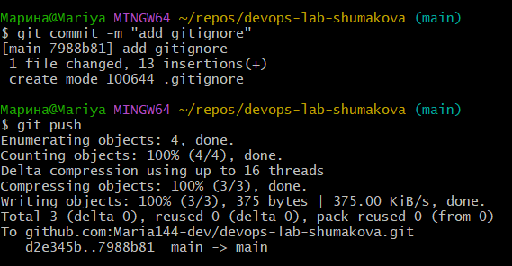
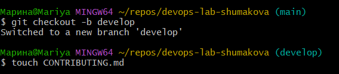
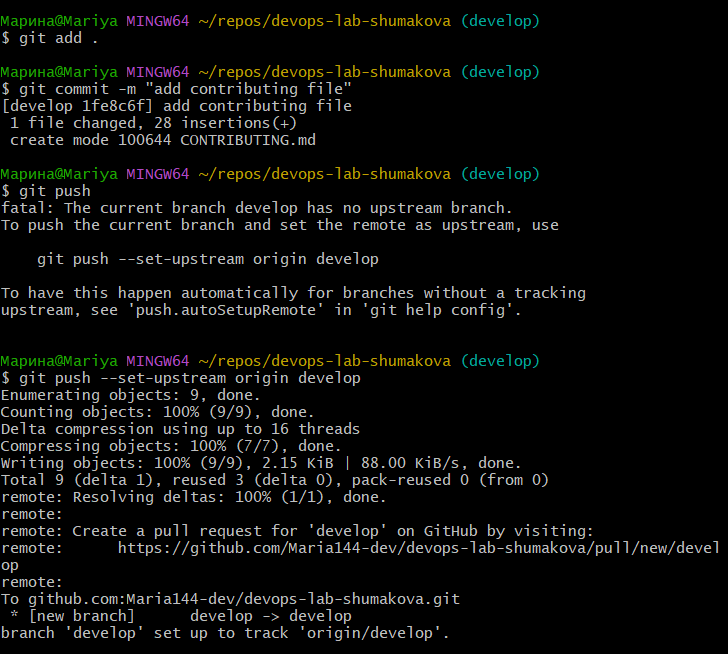
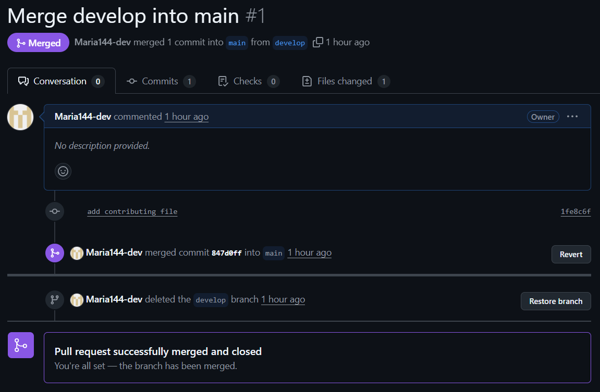

# Отчет по лабораторной №0

University: ITMO University  
Faculty: FTMI  
Course: introduction-in-web-tech  
Year: 2025/2026  
Group: U4225  
Author: Shumakova Maria  
Lab: Lab0  
Date of create: 29.09.2025
Date of finished: 30.09.2025

---
### Шаги выполнения

После создания аккаунта в gitHub и инициализации репозитория необходимо получить к нему удаленный доступ. Для этого:
- Устанавливаем git на компьютер
- Генерируем ssh и добавляем его к своему аккаунту на gitHub
- Клонируем репозиторий через ssh и переходим в папку выполнив команды:

Далее добавляем .gitignore, заполненный каким-то содержимым. Посмотрим на статус репозитория

Добавим измененный файл, закоммитим изменения и запушим в репозиторий

  

Далее создадим и перейдем на ветку develop. Добавим файл CONTRIBUTING.md и заполним его с компьютера

Аналогично предыдущим шагам запушим изменения

Создадим реквест на ветку main и замерждим изменения

