# Отчет по лабораторной №1

University: ITMO University  
Faculty: FTMI  
Course: introduction-in-web-tech  
Year: 2025/2026  
Group: U4225  
Author: Shumakova Maria  
Lab: Lab1 
Date of create: 07.10.2025
Date of finished: 07.10.2025

---
### Шаги выполнения

Установим докер с [официального сайта](https://www.docker.com/) и проверим его доступность в PS

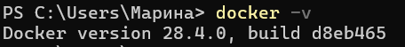

Запускаем первый контейнер

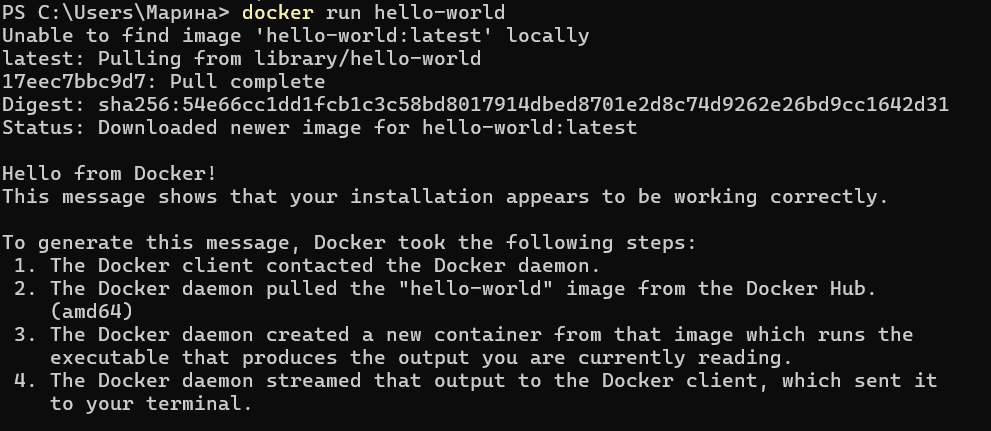

Выполним поочередно `docker images`, `docker ps`, `docker ps -a` и посмотрим на результат

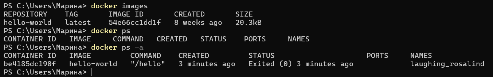

- `docker images` - выводит список образов, которые находятся на локальном хосте
- `docker ps` - отображает список активных контейнеров
- `docker ps -a` - отображает список всех контейнеров

Ставим образ Ubuntu и запускаем контейнер

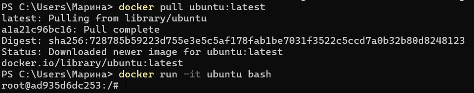

В среде Ubuntu обновляем пакеты и ставим `curl`. Убедимся, что все хорошо

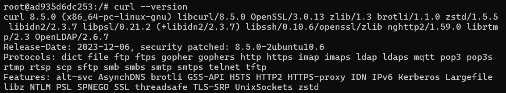

Запускаем контейнер с nginx и проверим локалхост на порту 8080

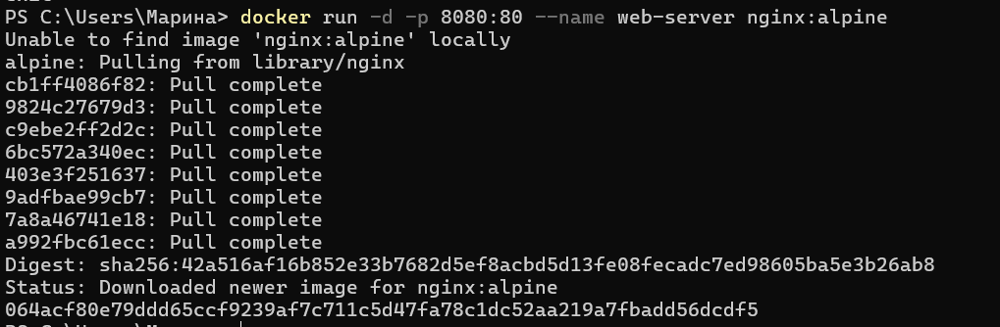  
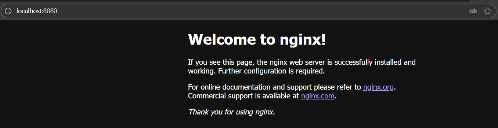

Посмотрим логи контейнера и убедимся, что отобразилась ионфрмация о посещении

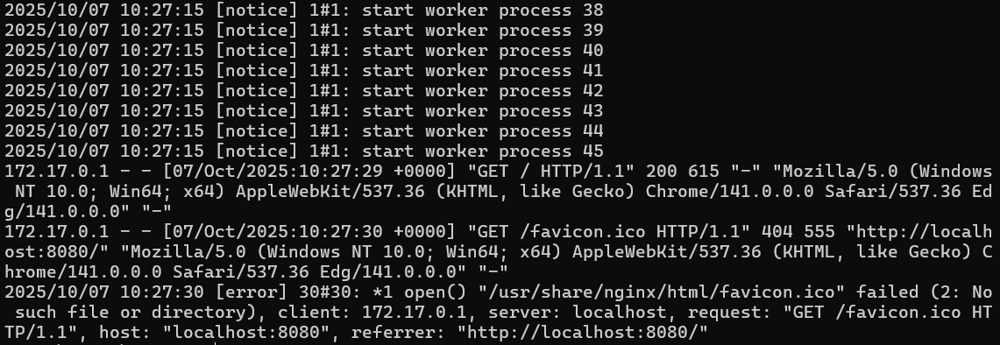

Проведем операции с контейнерами для закрепления материала  

- Посмотреть запущенные контейнеры: `docker ps`
- Посмотреть все контейнеры: `docker ps -a`
- Остановить контейнер: `docker stop web-server`
- Запустить остановленный контейнер: `docker start web-server`
- Удалить контейнер: `docker rm web-server`
- Удалить образ: `docker rmi nginx:alpine`

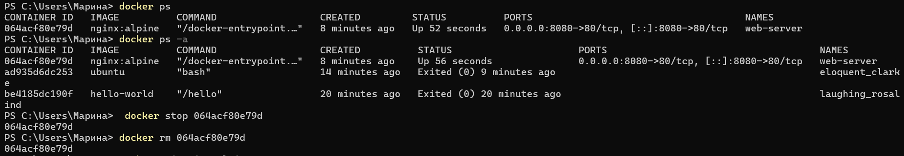  
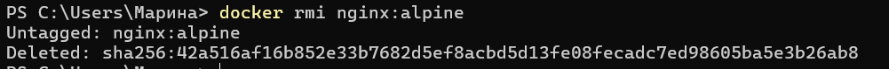

Создадим том и запустим контейнер с ним, подключимся к контейнеру и создадим файл. Далее выходим, удаляем контейнер и создаем новый с таким же томом

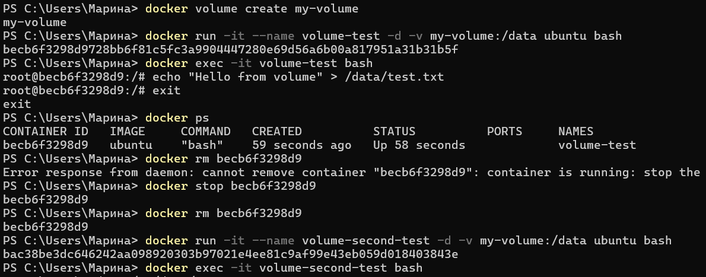

Проверяем наличие файла

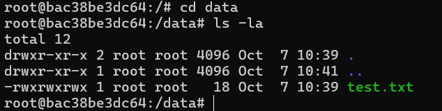
